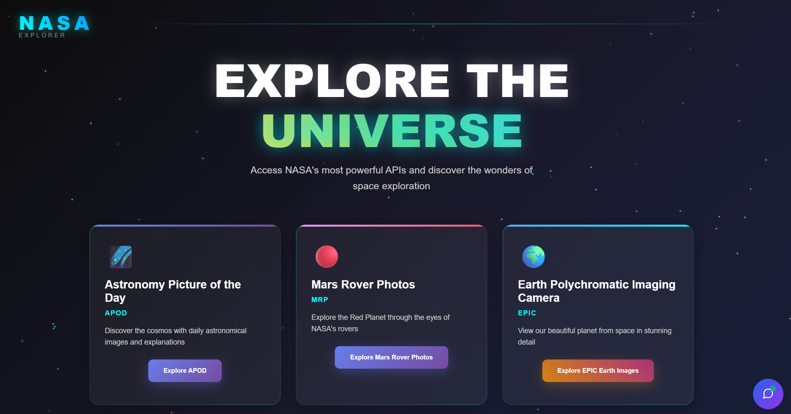

# NASA Explorer 🚀

A comprehensive web application that utilizes NASA's Open APIs to showcase space-related data through an interactive and visually appealing interface. Built with React frontend and Node.js/Express backend.

## 📸 Screenshots & Demo

### Application Overview

*Main dashboard showing the NASA Explorer interface*

### Key Features Demo

*Interactive demonstration of key application features*

### Data Visualizations

*Astronomy Picture of the Day feature*


*Mars Rover photo gallery with filtering*


*Near Earth Objects data visualization*

## 🌟 Features

- **Astronomy Picture of the Day (APOD)**: Daily stunning space imagery with detailed descriptions
- **Mars Rover Photos**: Explore photos from NASA's Mars rovers with filtering capabilities
- **Near Earth Objects (NEO)**: Track asteroids and comets approaching Earth
- **GROQ AI Integration**: Enhanced data interpretation and insights
- **Epic Earth Imagery**: Real-time Earth photography from space
- **NASA Image & Video Library**: Search and browse NASA's media collection
- **Responsive Design**: Optimized for desktop, tablet, and mobile devices
- **Real-time Loading States**: Smooth user experience with loading indicators
- **Error Handling**: Comprehensive error management and user feedback

## 🏗️ Architecture

### Project Structure
```
NASAEXPLORER/
├── backend/
│   ├── controllers/
│   │   ├── groqController.js
│   │   └── nasaController.js
│   ├── node_modules/
│   ├── routes/
│   │   ├── groqRoutes.js
│   │   └── nasaRoutes.js
│   ├── services/
│   │   ├── groqService.js
│   │   └── nasaService.js
│   ├── app.js
│   ├── package-lock.json
│   ├── package.json
│   ├── README.md
│   └── server.js
├── frontend/
│   ├── node_modules/
│   ├── public/
│   ├── src/
│   │   ├── api/
│   │   │   ├── groqHandler.js
│   │   │   └── nasa.js
│   │   ├── assets/
│   │   ├── components/
│   │   │   ├── AnimatedStarfield.jsx
│   │   │   ├── ApodNasa.jsx
│   │   │   ├── EpicNasa.jsx
│   │   │   ├── FirstPage.jsx
│   │   │   ├── GroqAi.css
│   │   │   ├── GroqAi.jsx
│   │   │   ├── ImageAndVideo.jsx
│   │   │   ├── MarsRoverPhotos.jsx
│   │   │   └── NearEarth.jsx
│   │   ├── hooks/
│   │   │   ├── useApod.jsx
│   │   │   ├── useEpic.jsx
│   │   │   ├── useGroq.jsx
│   │   │   ├── useMarsRoverPhotos.jsx
│   │   │   ├── useNasaSearch.jsx
│   │   │   └── useNearEarth.jsx
│   │   ├── App.css
│   │   ├── App.jsx
│   │   └── main.jsx
│   ├── .env
│   ├── .gitignore
│   ├── eslint.config.js
│   ├── index.html
│   ├── package-lock.json
│   ├── package.json
│   ├── README.md
│   └── vite.config.js
└── .gitignore
```

### Backend Architecture

The backend follows a clean, modular architecture with separation of concerns:

- **Controllers**: Handle HTTP requests and responses
  - `nasaController.js`: Manages NASA API endpoints
  - `groqController.js`: Handles AI-powered data processing
- **Services**: Business logic and external API interactions
  - `nasaService.js`: NASA API integration and data processing
  - `groqService.js`: GROQ AI service for enhanced insights
- **Routes**: API endpoint definitions
  - `nasaRoutes.js`: NASA data endpoints
  - `groqRoutes.js`: AI processing endpoints

### Frontend Architecture

The frontend uses modern React patterns with custom hooks and component composition:

- **Components**: Reusable UI components for different NASA data types
- **Hooks**: Custom hooks for data fetching and state management
- **API Layer**: Centralized API communication handlers
- **Assets**: Static resources and styling

## 🚀 Getting Started

### Prerequisites

- Node.js (v16 or higher)
- npm or yarn
- NASA API Key (free from [NASA API](https://api.nasa.gov/))
- GROQ API Key (optional, for AI features)

### Installation

1. **Clone the repository**
   ```bash
   git clone https://github.com/yourusername/nasa-explorer.git
   cd nasa-explorer
   ```

2. **Install Backend Dependencies**
   ```bash
   cd backend
   npm install
   ```

3. **Install Frontend Dependencies**
   ```bash
   cd ../frontend
   npm install
   ```

4. **Environment Configuration**

   Create `.env` files in both backend and frontend directories:

   **Backend `.env`:**
   ```env
   PORT=5000
   NASA_API_KEY=your_nasa_api_key_here
   GROQ_API_KEY=your_groq_api_key_here
   FRONTEND_URL=http://localhost:3000
   ```

   **Frontend `.env`:**
   ```env
   VITE_API_URL=http://localhost:5000
   VITE_NASA_API_KEY=your_nasa_api_key_here
   ```

### Running the Application

1. **Start the Backend Server**
   ```bash
   cd backend
   npm start
   # Server runs on http://localhost:5000
   ```

2. **Start the Frontend Application**
   ```bash
   cd frontend
   npm run dev
   # Application runs on http://localhost:3000
   ```

3. **Access the Application**
   Open your browser and navigate to `http://localhost:3000`

## 🌐 Deployment

### Vercel Deployment

The application is deployed on Vercel with the following configuration:

1. **Frontend Deployment**: Automatically deployed from the `frontend` directory
2. **Backend Deployment**: Deployed as Vercel serverless functions

**Live Application**: [https://your-nasa-explorer.vercel.app](https://your-nasa-explorer.vercel.app)

### Deployment Steps

1. **Prepare for Deployment**
   ```bash
   # Build the frontend
   cd frontend
   npm run build
   ```

2. **Vercel Configuration**
   Create `vercel.json` in the root directory:
   ```json
   {
     "builds": [
       {
         "src": "frontend/package.json",
         "use": "@vercel/static-build"
       },
       {
         "src": "backend/server.js",
         "use": "@vercel/node"
       }
     ],
     "routes": [
       {
         "src": "/api/(.*)",
         "dest": "backend/server.js"
       },
       {
         "src": "/(.*)",
         "dest": "frontend/dist/$1"
       }
     ]
   }
   ```

3. **Deploy to Vercel**
   ```bash
   npm install -g vercel
   vercel --prod
   ```

## 📋 Requirements Fulfillment

| Requirement | Status | Implementation Details |
|-------------|--------|----------------------|
| **React Frontend** | ✅ Complete | Modern React with hooks, component composition, and responsive design |
| **Node.js Backend** | ✅ Complete | Express server with modular architecture and API integration |
| **Express Framework** | ✅ Complete | RESTful API with proper routing and middleware |
| **NASA API Integration** | ✅ Complete | Multiple NASA endpoints: APOD, Mars Rovers, NEO, EPIC, Image Library |
| **Data Visualization** | ✅ Complete | Interactive galleries, detailed views, and responsive layouts |
| **Frontend Design & UI/UX** | ✅ Complete | Modern, space-themed design with smooth animations |
| **Creativity & Uniqueness** | ✅ Complete | AI integration, animated starfield, unique data presentations |
| **Backend Architecture** | ✅ Complete | Clean separation of concerns with controllers, services, and routes |
| **Error Handling** | ✅ Complete | Comprehensive error management on both frontend and backend |
| **Loading States** | ✅ Complete | Loading indicators and smooth state transitions |
| **Code Quality** | ✅ Complete | Well-structured, readable code following best practices |
| **Repository Organization** | ✅ Complete | Clear project structure with proper documentation |
| **README Documentation** | ✅ Complete | Comprehensive setup and usage instructions |
| **Deployment** | ✅ Complete | Successfully deployed on Vercel |
| **User Interactivity** | ✅ Bonus | Filtering, search functionality, and interactive elements |
| **Responsive Design** | ✅ Bonus | Mobile-first approach with responsive layouts |
| **Performance Optimization** | ✅ Bonus | Optimized loading, caching, and efficient API calls |
| **AI Features** | ✅ Bonus | GROQ AI integration for enhanced data insights |
| **Testing** | ❌ Not Implemented | Unit and integration tests not included |

## 🎯 What We Accomplished

### Core Features
- **Multi-API Integration**: Successfully integrated 5+ NASA API endpoints
- **AI Enhancement**: Added GROQ AI for intelligent data interpretation
- **Responsive Design**: Fully responsive across all device sizes
- **Real-time Data**: Live fetching and display of NASA data
- **Interactive UI**: Smooth animations and user-friendly interface

### Technical Achievements
- **Clean Architecture**: Modular backend with separation of concerns
- **Custom Hooks**: Reusable React hooks for data management
- **Error Boundaries**: Comprehensive error handling and user feedback
- **Performance**: Optimized API calls and efficient state management
- **Deployment**: Successfully deployed full-stack application

## 🔧 Areas for Improvement

### Testing Implementation
- **Unit Tests**: Add Jest tests for components and utility functions
- **Integration Tests**: Test API endpoints and data flow
- **E2E Tests**: Implement Cypress for end-to-end testing
- **Test Coverage**: Aim for 80%+ code coverage

### Performance Optimizations
- **Caching**: Implement Redis for API response caching
- **Image Optimization**: Add lazy loading and image compression
- **Bundle Splitting**: Optimize webpack bundles for faster loading
- **Database**: Consider adding database for user preferences and caching

### Additional Features
- **User Authentication**: User accounts and personalized experiences
- **Favorites System**: Allow users to save favorite images/data
- **Advanced Filtering**: More sophisticated search and filter options
- **Offline Support**: PWA features for offline functionality

## 🐛 Known Issues & Challenges

### API Rate Limiting
- **Issue**: NASA API has rate limits that can affect heavy usage
- **Mitigation**: Implemented request throttling and caching strategies
- **Future Fix**: Add backend caching layer with Redis

### Mobile Performance
- **Issue**: Large images can slow loading on mobile devices
- **Current Fix**: Responsive images and loading states
- **Improvement**: Implement progressive image loading

### Error Recovery
- **Issue**: Some API failures don't have retry mechanisms
- **Current State**: Basic error handling with user feedback
- **Enhancement**: Implement exponential backoff retry logic

## 🛠️ Technologies Used

### Frontend
- **React 18**: Modern React with hooks and functional components
- **Vite**: Fast build tool and development server
- **CSS3**: Custom styling with animations and responsive design
- **Axios**: HTTP client for API requests

### Backend
- **Node.js**: JavaScript runtime environment
- **Express**: Web application framework
- **Axios**: HTTP client for external API calls
- **CORS**: Cross-origin resource sharing middleware

### APIs & Services
- **NASA Open APIs**: Multiple endpoints for space data
- **GROQ AI**: AI-powered data enhancement and insights

### Deployment & Tools
- **Vercel**: Deployment platform for both frontend and backend
- **Git**: Version control system
- **ESLint**: Code linting and formatting

## 📝 API Endpoints

### NASA Data Endpoints
- `GET /api/nasa/apod` - Astronomy Picture of the Day
- `GET /api/nasa/mars-photos` - Mars Rover photographs
- `GET /api/nasa/neo` - Near Earth Objects data
- `GET /api/nasa/epic` - Earth Polychromatic Imaging Camera
- `GET /api/nasa/search` - NASA Image and Video Library search

### AI Enhancement Endpoints
- `POST /api/groq/analyze` - AI-powered data analysis and insights

## 👨‍💻 Development

### Code Style
- ES6+ JavaScript features
- Functional programming patterns
- Consistent naming conventions
- Comprehensive commenting

### Git Workflow
- Feature branch development
- Descriptive commit messages
- Regular commits with small, focused changes

## 📄 License

This project is licensed under the MIT License - see the [LICENSE](LICENSE) file for details.

## 🙏 Acknowledgments

- **NASA**: For providing free access to incredible space data through their Open APIs
- **GROQ**: For AI-powered data enhancement capabilities
- **Vercel**: For seamless deployment and hosting platform

## 📞 Contact

For questions, suggestions, or collaboration opportunities:

- **GitHub**: [Your GitHub Profile](https://github.com/yourusername)
- **Email**: your.email@example.com
- **LinkedIn**: [Your LinkedIn Profile](https://linkedin.com/in/yourprofile)

---

*Built with ❤️ and curiosity about the cosmos* 🌌
